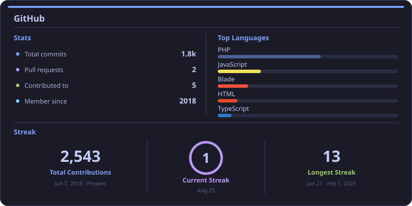

<h1 align="center">Muhammad Afaq Umar</h1>

<strong>Senior Full-Stack Engineer (Backend-Heavy)</strong>

<em>I build the systems your startup can't outgrow.</em>

  

  $10M+/mo in payments · 90K+ users · 5K daily uploads · zero downtime

  
  
  
  
  

  

---

## What I ship

Full-stack engineer with **7+ years** shipping payment platforms, distributed pipelines, and production backends that handle real traffic — not toy projects.

I own the stack from schema to deploy: Laravel/PHP APIs, multi-gateway billing, AWS (EC2, RDS, S3, SQS, Lambda), Redis queues, and Go/Python workers where the problem needs them. I have inherited outages, slow queries, and a live supply-chain compromise, and turned those systems into the most stable part of the stack.

**Ask me about:** Laravel at scale, payment retries, event-driven file pipelines, GraphQL, and Composer security.

## Impact

| Payments | Patients | Daily uploads | Recovery |
| :---: | :---: | :---: | :---: |
| **$10M+/mo** | **90K+** | **5,000+** | **30 hours, zero downtime** |

## Featured work

**Prescription Hope** — Healthtech / Payments  
Healthcare platform processing **$10M+/month** for **90K+ patients**. Owned the backend across employee and patient portals. Built a unified payment layer over Stripe, USAePay, and Payroc with automated retries, 20+ billing crons, and sub-100ms query paths on MySQL/AWS. **Zero payment downtime.**

**Veva Collect** — Music-tech / Distributed systems  
File pipeline for major labels and Grammy-winning producers: **5,000+ daily uploads** (up to 10GB) and async ZIP creation for **25GB+** shares. Laravel API + Go workers on AWS S3, SQS, Lambda, Redis, and GraphQL. **Upload outages went to zero.**

**Aldawli ERP** — Enterprise / Security  
Found and neutralized a Composer supply-chain backdoor (hidden admin routes, obfuscated payloads) on a live ERP. Isolated execution paths, sanitized the package, revalidated every module — **30 hours, zero downtime.**  
[Write-up on Medium](https://medium.com/@afaqumarbsse/the-hidden-backdoor-how-a-single-composer-package-nearly-compromised-an-entire-erp-system-1efce1e74547)

**Step2Compliance** — Enterprise / Cross-platform  
Async `.xlsm` pipeline: Laravel queues a Python worker on Windows EC2, files land in S3, webhooks + WebSockets close the loop. **65% faster delivery, UI never blocked.**  
[Write-up on Medium](https://medium.com/@afaqumarbsse/the-right-environment-for-the-right-problem-a-laravel-python-windows-ec2-architecture-case-study-c8076215f086)

## Tech stack

Backend, data, and APIs

  

Cloud and delivery

  

Languages and frontend

  

### Integrations

  
  
  
  
  
  
  
  
  
  
  

## GitHub

  

## Writing

<table>
  <tr>
    <td width="50%" valign="top">
      <h3>Security</h3>
      <h3><a href="https://medium.com/@afaqumarbsse/the-hidden-backdoor-how-a-single-composer-package-nearly-compromised-an-entire-erp-system-1efce1e74547">The Hidden Backdoor in a Composer Package</a></h3>
      
How I found and neutralized a supply-chain attack on a live ERP — obfuscated payloads, hidden admin routes, 30 hours to full recovery.

      
<a href="https://medium.com/@afaqumarbsse/the-hidden-backdoor-how-a-single-composer-package-nearly-compromised-an-entire-erp-system-1efce1e74547">Read on Medium →</a>

    </td>
    <td width="50%" valign="top">
      <h3>System Design</h3>
      <h3><a href="https://medium.com/@afaqumarbsse/the-right-environment-for-the-right-problem-a-laravel-python-windows-ec2-architecture-case-study-c8076215f086">The Right Environment for the Right Problem</a></h3>
      
Laravel queues a Python worker on Windows EC2 for .xlsm generation — 65% faster delivery without blocking the UI.

      
<a href="https://medium.com/@afaqumarbsse/the-right-environment-for-the-right-problem-a-laravel-python-windows-ec2-architecture-case-study-c8076215f086">Read on Medium →</a>

    </td>
  </tr>
</table>

## Let's talk

Open to **Senior Backend / Full-Stack** roles — remote or relocation (US/EU).

**[afaqumarbsse@gmail.com](mailto:afaqumarbsse@gmail.com)** · [LinkedIn](https://linkedin.com/in/muhammad-afaq-umar-537ab715a) · [Portfolio](https://codetalker007.github.io)
